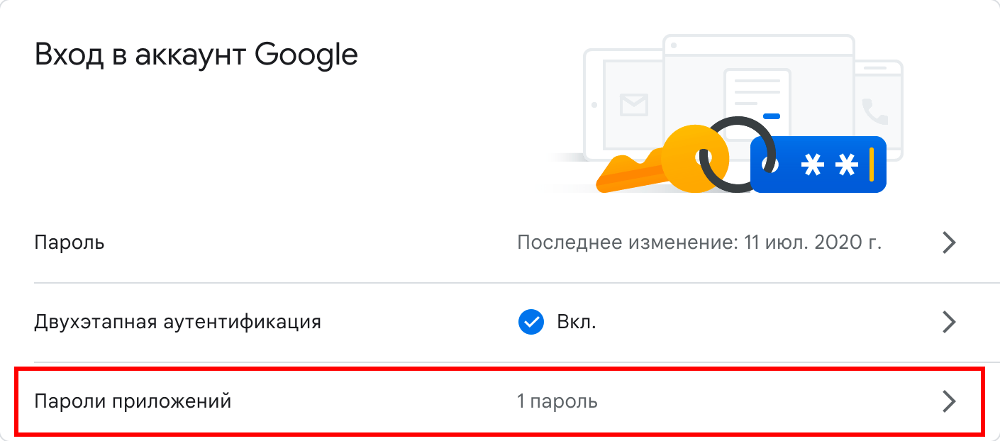

# Cool site

Simple but cool PHP site


## Requirements

To run this application, you will need a configured environment consisting of:


- [Apache httpd 2.4.54 (or above)](https://httpd.apache.org/download.cgi#apache24)
- [PHP 8.1.12 (or above)](https://www.php.net/downloads.php)
- [MariaDB Server 10.8.3 (or above)](https://mariadb.org/download/?t=mariadb&o=true&p=mariadb&r=10.8.3)
- [Composer 2.4.4 (or above)](https://getcomposer.org/)


## Installation

1. Expand this folder to the root of any domain folder
1. Enter your configs in the `config.php` in the following way:
    ```
    ...

    # MySQL (MariaDB) server configs
    $db_config = [
        "hostname" => "localhost",
        "username" => "root",
        "password" => "HardPassword",  
        "db_name" => "cool_site_db",
        "port" => null,
    ];

    ...
    ```

    Go to your Google account [security settings](https://myaccount.google.com/security?pli=1) and create a new app password:
    

    ```
    ...

    # administrator to send emails to
    $admin = [
        "mail" => "<e-mail>",
        "password" => "<password you created now>",
    ];

    ...
    ```
1. Open `db/create.php` in a browser to create a database
1. (Optional) If you would like to start with some previously created data import database from `cool_site_db.sql`

### That's it, now it's ready to test!